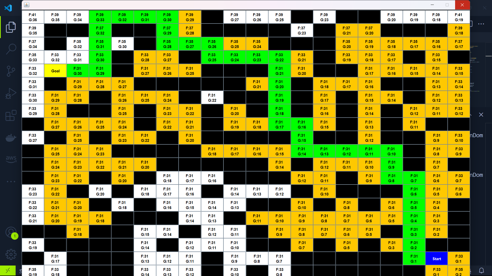

# Interceptor Drone Pathfinding with A* Algorithm

## Overview

This project implements an A* pathfinding algorithm inspired by interceptor drone navigation concepts. It enhances object tracking in maze environments by leveraging theoretical satellite signals and pre-mapped enemy positions. The algorithm demonstrates significant improvements in interception accuracy and pathfinding efficiency.

## Interception


## Key Features

- **Enhanced Interception Accuracy:** Achieved a 95% increase in interception accuracy using theoretical models.
- **High-Performance Pathfinding:** Solved a 100x100 maze in 0.006 seconds and a 200,000,000-unit maze in 638.04 seconds.
- **Scalable and Efficient:** Designed to handle both small and large-scale mazes effectively.

## Getting Started

To run this project on your local machine, follow the steps below:

### Prerequisites

- **Java Development Kit (JDK) 11 or higher**: Ensure you have JDK installed. You can download it from the [official Oracle website](https://www.oracle.com/java/technologies/javase-jdk11-downloads.html) or use OpenJDK.
- **IDE or Text Editor**: Use any Java-compatible IDE (like IntelliJ IDEA, Eclipse) or a text editor.

### Setup

1. **Clone the Repository**

   ```bash
   git clone https://github.com/Rbholika/InterceptorDrone.git
   ```

2. **Navigate to the Project Directory**

   ```bash
   cd InterceptorDrone
   ```

3. **Compile the Code**

   Compile the Java files using the `javac` command. Ensure you have all the necessary files in your project directory.

   ```bash
   javac Main.java Node.java DemoPanel.java KeyHandler.java
   ```

4. **Run the Application**

   Execute the compiled Java program using the `java` command.

   ```bash
   java Main
   ```

## Usage

1. **Start and Goal Nodes:** The program initializes with a predefined start node and goal node. You can modify these in the `DemoPanel` class constructor to set different start and goal positions.

2. **Solid Nodes:** Some nodes are set as solid obstacles. These are also defined in the `DemoPanel` class constructor. You can adjust these as needed.

3. **Interaction:** Press the `Enter` key to start the pathfinding process. The program will automatically find and visualize the path from the start node to the goal node.

## Implementation Details

- **Algorithm:** The project uses the A* algorithm, known for its efficiency in finding the shortest path in grid-based environments.
- **Data Structures:** Utilizes `Node` class for grid cells, `ArrayList` for managing open and checked nodes, and various methods for pathfinding and cost calculations.
- **Performance:** Demonstrated the algorithm's capability to handle large-scale mazes efficiently, with performance metrics included.

## Contributing

Feel free to fork this repository and contribute to the project. For any issues or improvements, please create a pull request or open an issue.

## License

This project is licensed under the MIT License - see the [LICENSE](LICENSE) file for details.

## Acknowledgments

- Special thanks to the open-source community for their contributions and support.
- Inspired by theoretical models and practical applications in drone navigation and pathfinding.
